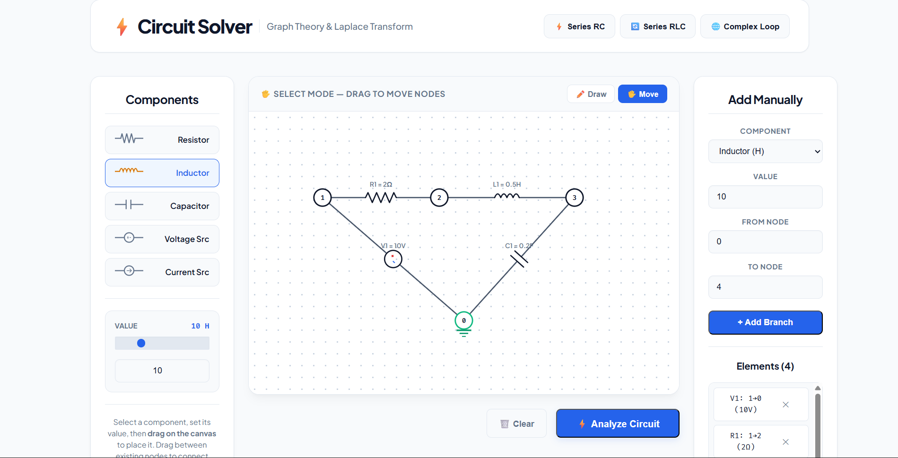
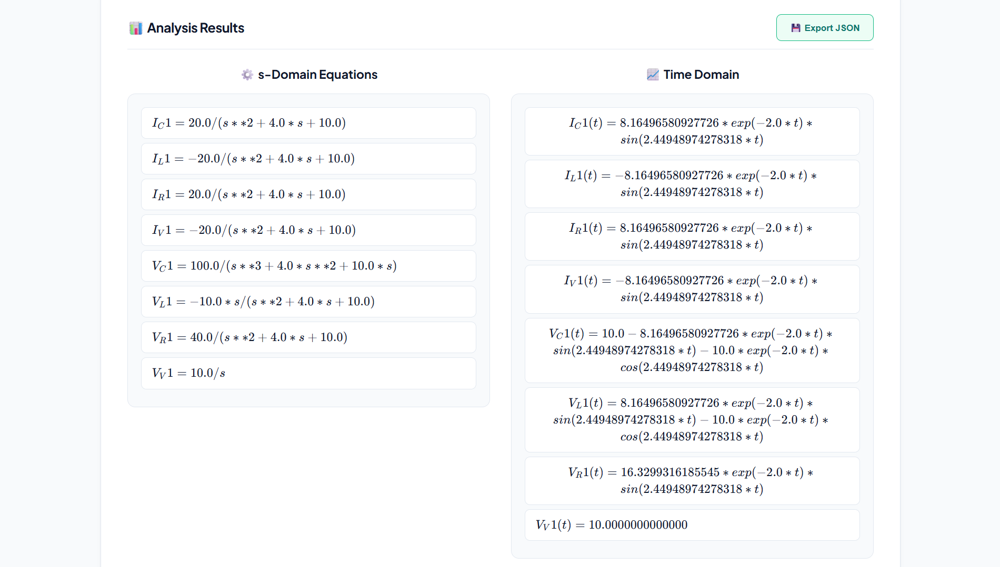
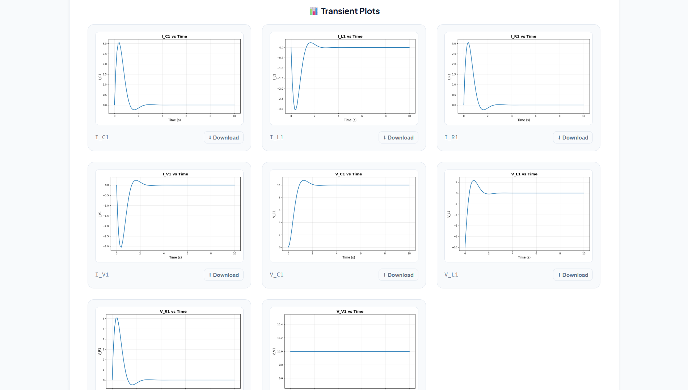
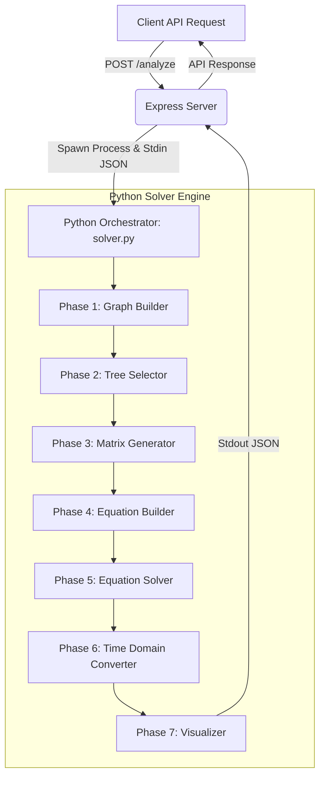

# 🔌 Circuit Solver - Graph Theory & Laplace Transform Analysis

A high-performance, symbolic electrical circuit analyzer that models circuits as directed graphs, constructs fundamental network matrices (Incidence, Cut Set, and Tie Set), and solves circuit equations symbolically in the s-domain using **Laplace Transforms** and converts them to the time-domain.


---

## 📸 System Walkthrough & Visuals

The circuit solver bridges an interactive, node-and-branch graphical user interface with a rigid, multi-phase mathematical solver engine:

### 1. Interactive Circuit Designer
Users drag-and-drop electrical components (resistors, capacitors, inductors, step voltage/current sources) onto a grid canvas to define circuit nodes and branches.


### 2. Symbolic Equations Output
The Python solver calculates symbolic equations in the s-domain using Laplace transforms and performs Inverse Laplace Transforms ($\mathcal{L}^{-1}$) to compute analytical time-domain functions.


### 3. Numerical Transient Response Plots
The analytical time-domain equations are evaluated numerically and plotted across $t \in [0, 10]$ seconds to visualize the transient responses.


---

## ⚙️ Backend Solver Architecture

The backend of the application is split into two layers: the **Node.js Express Server Bridge** and the **7-Phase Python Symbolic Solver**.



### Express Server Bridge (`server/server.js`)
The server acts as a stateless API gateway. When it receives a `/analyze` POST request:
1. It validates the request format and extracts nodes and branches.
2. It spawns a Python subprocess executing `engine/solver.py`.
3. It pipes the circuit configuration JSON via `stdin` to the subprocess.
4. It reads the computed symbolic responses, analytical equations, and base64-encoded plot images from `stdout` and returns them to the client.

### The 7-Phase Symbolic Solver (`engine/solver.py`)
The Python solver decomposes circuit analysis into seven modules located under `engine/phases/`:

1. **Phase 1: Graph Builder (`graph_builder.py`)**  
   Reads the JSON data and converts it into a directed `networkx.MultiGraph`. It validates that the network forms a single connected component and containing node `0` as the reference ground.
   
2. **Phase 2: Spanning Tree Selector (`tree_selector.py`)**  
   Partitions the circuit graph into a spanning tree (**twigs**) and a cotree (**links**) using a weighted Minimum Spanning Tree (MST) algorithm. It assigns custom edge weights:
   * **Voltage Sources (V)**: Weight `0` (forces voltage sources into tree branches to simplify KVL equations).
   * **Current Sources (I)**: Weight `100` (forces current sources into co-tree links to simplify KCL equations).
   * **Passive Elements (R, L, C)**: Weight `1`.

3. **Phase 3: Matrix Generator (`matrix_generator.py`)**  
   Calculates three fundamental matrices representing the network topology:
   * **Incidence Matrix ($A$)**: Relates nodes to branches. Removing the row for node `0` yields the reduced incidence matrix $A_{red}$.
   * **Cut Set Matrix ($Q$)**: Represents KCL relations. It is derived as $Q = [I_{n_t} \mid Q_l]$ where $Q_l = -A_t^{-1} \cdot A_l$.
   * **Tie Set Matrix ($B$)**: Represents KVL relations. It is derived as $B = [B_t \mid I_{n_l}]$ where $B_t = -Q_l^T$.

4. **Phase 4: Equation Builder (`equation_builder.py`)**  
   Formulates a linear system of $2b$ algebraic equations in the Laplace variable $s$ (where $b$ is the number of branches):
   * $n_{twigs}$ KCL equations: $Q \cdot I_{branch} = 0$
   * $n_{links}$ KVL equations: $B \cdot V_{branch} = 0$
   * $b$ Branch constitutive relationships (see component s-domain models below).

5. **Phase 5: Equation Solver (`equation_solver.py`)**  
   Solves the symbolic linear system of equations using `sympy.solve` to extract formulas for all branch voltages ($V_k(s)$) and currents ($I_k(s)$) in terms of the Laplace variable $s$.

6. **Phase 6: Time-Domain Converter (`time_domain.py`)**  
   Performs symbolic Inverse Laplace Transforms ($\mathcal{L}^{-1}$) using `sympy.inverse_laplace_transform` to compute time-domain equations $v_k(t)$ and $i_k(t)$. These are compiled into numerical NumPy functions via `sympy.lambdify` and evaluated over a time array.

7. **Phase 7: Visualizer (`visualizer.py`)**  
   Plots transient curves of the voltages and currents using `matplotlib` in a headless backend (`Agg`). The generated plots are saved to memory buffers as PNG files and encoded into Base64 strings.

---

## 🧮 Mathematical Engine & Graph Theory Principles

The backend utilizes network graph theory to systematically generate independent sets of Kirchhoff's Current and Voltage laws.

### Spanning Tree Partitioning
For a circuit graph with $n$ nodes and $b$ branches:
* The **Spanning Tree** is a subgraph that connects all nodes without containing any loops. The branches of this tree are called **twigs**.
  $$\text{Number of twigs } (n_t) = n - 1$$
* The remaining branches not included in the tree form the **cotree**, and their branches are called **links**.
  $$\text{Number of links } (n_l) = b - n_t = b - n + 1$$

### Fundamental Matrices

#### 1. Reduced Incidence Matrix ($A_{red}$)
The matrix size is $(n-1) \times b$. Rows correspond to non-reference nodes, and columns correspond to sorted branches (twigs first, then links).
$$A_{i,j} = \begin{cases} 
+1 & \text{if branch } j \text{ leaves node } i \\
-1 & \text{if branch } j \text{ enters node } i \\
0 & \text{otherwise}
\end{cases}$$

#### 2. Cut Set Matrix ($Q$)
Each tree branch (twig) defines a unique cut set. The cut set matrix $Q$ of size $n_t \times b$ relates branch currents and expresses Kirchhoff's Current Law:
$$Q \cdot \mathbf{I}(s) = 0$$
Divided into twigs and links:
$$Q = [I_{n_t} \mid Q_l] \implies \mathbf{I_{twigs}}(s) + Q_l \mathbf{I_{links}}(s) = 0$$

#### 3. Tie Set Matrix ($B$)
Each co-tree branch (link) forms a unique loop (tie set) when added to the spanning tree. The tie set matrix $B$ of size $n_l \times b$ relates branch voltages and expresses Kirchhoff's Voltage Law:
$$B \cdot \mathbf{V}(s) = 0$$
Derived directly from the cut set relationship:
$$B = [B_t \mid I_{n_l}] \quad \text{where} \quad B_t = -Q_l^T$$

### s-Domain Component Models
The solver converts components to their equivalent algebraic s-domain models under step excitations (assuming zero initial conditions):

| Component | Time-Domain | s-Domain Impedance ($Z(s)$) | s-Domain Constitutive Equation |
| :--- | :--- | :--- | :--- |
| **Resistor (R)** | $v(t) = R \cdot i(t)$ | $R$ | $V(s) - R \cdot I(s) = 0$ |
| **Inductor (L)** | $v(t) = L \frac{di(t)}{dt}$ | $sL$ | $V(s) - sL \cdot I(s) = 0$ |
| **Capacitor (C)** | $i(t) = C \frac{dv(t)}{dt}$ | $\frac{1}{sC}$ | $V(s) - \frac{1}{sC} \cdot I(s) = 0$ |
| **Voltage Source (V)** | $v(t) = V_s \cdot u(t)$ | — | $V(s) - \frac{V_s}{s} = 0$ |
| **Current Source (I)** | $i(t) = I_s \cdot u(t)$ | — | $I(s) - \frac{I_s}{s} = 0$ |

> [!NOTE]
> All sources are modeled as step inputs using the Heaviside step function $u(t)$, which transforms to $1/s$ in the s-domain.

---

## 🔌 REST API & Command-Line Execution

### 1. REST API Endpoint: `POST /analyze`
Invoked by the frontend to solve a circuit configuration.

* **Request Body Structure (`application/json`)**:
  ```json
  {
    "nodes": ["0", "1", "2"],
    "branches": [
      { "id": "V1", "from": "1", "to": "0", "type": "V", "value": 10 },
      { "id": "R1", "from": "1", "to": "2", "type": "R", "value": 5 },
      { "id": "C1", "from": "2", "to": "0", "type": "C", "value": 0.1 }
    ]
  }
  ```

* **Response Structure (`application/json`)**:
  ```json
  {
    "status": "success",
    "equations": {
      "V_V1": "10/s",
      "I_R1": "2/(s + 2)",
      "V_C1": "10/(s*(s + 2))"
    },
    "time_domain": {
      "V_V1": "10*Heaviside(t)",
      "I_R1": "2*exp(-2*t)",
      "V_C1": "5 - 5*exp(-2*t)"
    },
    "plots": [
      {
        "name": "I_R1",
        "image": "iVBORw0KGgoAAAANSUhEUgAAAoAAAAGPCAYAAAD..."
      }
    ]
  }
  ```

### 2. Standalone Solver Command-Line Run
The Python solver engine can be run directly from the command line without starting the Node.js backend. It reads from standard input and prints result JSON to standard output.

* **Run Default Test Case (Series RLC Circuit)**:
  Provide an empty string as input to trigger the default circuit definition:
  ```bash
  # Windows Powershell
  echo "" | python engine/solver.py
  
  # macOS / Linux Bash
  echo "" | python3 engine/solver.py
  ```

* **Run Custom Circuit Payload**:
  Pipe custom JSON data directly into the solver:
  ```bash
  # Windows Powershell
  '{"nodes": ["0", "1"], "branches": [{"id": "V1", "from": "1", "to": "0", "type": "V", "value": 12}, {"id": "R1", "from": "1", "to": "0", "type": "R", "value": 10}]}' | python engine/solver.py
  ```

---

## 📦 Installation & Setup

### Prerequisites
* **Node.js** (v16.0.0 or higher)
* **Python** (v3.8 or higher)
* **npm** (Node Package Manager)

### 1. Clone & Set Up Directory
```bash
git clone <repository_url>
cd CircuitAnalyser
```

### 2. Install Python Engine Dependencies
```bash
pip install -r engine/requirements.txt
```
> [!IMPORTANT]
> The engine requires `numpy`, `networkx`, `sympy`, and `matplotlib`.

### 3. Install Server Dependencies
```bash
cd server
npm install
cd ..
```

### 4. Install Frontend UI Dependencies
```bash
cd client
npm install
cd ..
```

---

## 🚀 Running the Application

To run the complete system, you must start both the API gateway and the frontend development server:

### Step 1: Start the Backend REST API Server
In a new terminal:
```bash
cd server
node server.js
```
The API server will listen on `http://localhost:3000`.

### Step 2: Start the Frontend Client
In a separate terminal:
```bash
cd client
npm run dev
```
The frontend dev environment will spin up at `http://localhost:5173`. Open this URL in your web browser.

---

## 🎨 Project Structure

```
CircuitAnalyser/
├── assets/                  # High-quality UI & plot screenshots
│   ├── designer_ui.png      # Circuit canvas designer
│   ├── equations_output.png # Symbolic solver rendering output
│   └── transient_plots.png  # Base64 response-generated plots
├── client/                  # Frontend UI codebase (React + Vite)
│   ├── src/
│   │   ├── App.jsx          # Main client interface
│   │   └── index.css        # Premium UI stylesheet
│   └── package.json
├── server/                  # API Gateway layer (Node.js + Express)
│   ├── server.js            # Spawns solver.py subprocess
│   └── package.json
└── engine/                  # Core Computational Engine (Python)
    ├── solver.py            # Orchestrator of analysis phases
    ├── requirements.txt     # Python math and graphing libraries
    ├── test_phases.py       # Engine validation test suite
    └── phases/              # Component modules for the 7 solver phases
        ├── __init__.py
        ├── graph_builder.py     # Network graph construction
        ├── tree_selector.py     # MST tree/cotree selection
        ├── matrix_generator.py  # Matrix A, Q, and B generator
        ├── equation_builder.py  # Formulation of independent KCL/KVL
        ├── equation_solver.py   # SymPy equation solver
        ├── time_domain.py       # Inverse Laplace transforms
        └── visualizer.py        # Headless matplotlib plotting
```

---

## 🔧 Troubleshooting

* **Python Path Error**: If the server fails to locate python, verify that `python` is added to your environment `PATH`. On systems where Python 3 is installed as `python3`, update the spawn executable in [server.js](file:///c:/Users/pavan/Downloads/disc%20D/Projects/CircuitAnalyser/server/server.js#L17) from `'python'` to `'python3'`.
* **Missing Module in Python**: Make sure you have installed packages inside your active environment. Run `pip install sympy numpy networkx matplotlib` to verify.
* **Canvas Unconnected Error**: The graph builder requires all nodes to form a single connected component. If an element is floating, the backend will return a `400` validation error.

---

## 🤝 Contributing

Contributions are welcome! If you would like to expand the backend engine capabilities, consider adding support for:
1. **Dependent Sources**: Voltage-controlled voltage sources (VCVS), current-controlled current sources (CCCS), etc.
2. **AC Analysis**: Steady-state frequency sweep solutions in the phasor domain.
3. **Non-Zero Initial Conditions**: Modeling capacitor initial voltage ($V_0/s$) and inductor initial current ($L \cdot I_0$) sources.
4. **Active Components**: Op-amp models using nullor equivalences in graph theory.

---

## 📄 License
This project is licensed under the MIT License. Feel free to use and distribute it for academic or personal projects.
